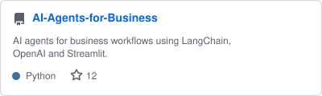

# Hi, I'm Sunil 👋

Building AI agents and web apps • open to opportunities

---

**💻 Tech Stack**

    

---

**🧑🏻‍💻 About me**

I'm an AI & Web Developer who enjoys building intelligent agents and modern web applications.
I work with LangChain, LLMs, Django, and React to solve real-world problems.
Always learning, always building.

---

**📊 GitHub stats**

  

---

**📌 Pinned projects**

  
  

---

**🔗 Connect**

 &nbsp;  &nbsp; 
